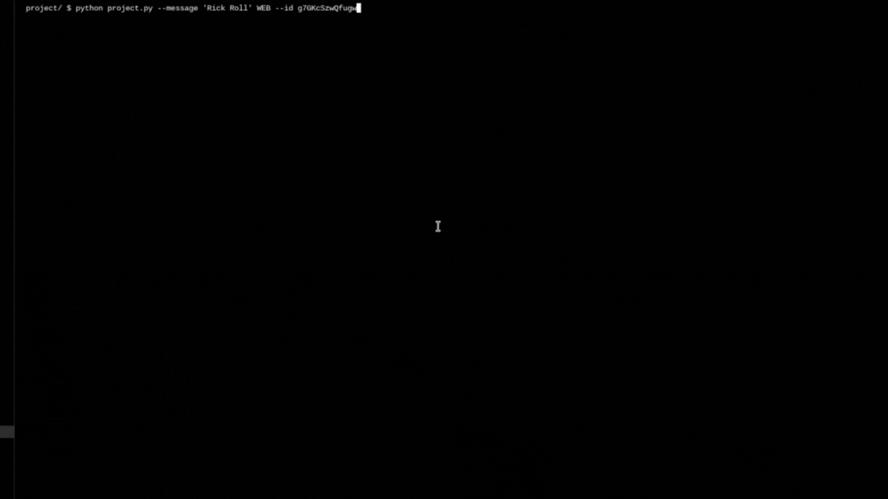
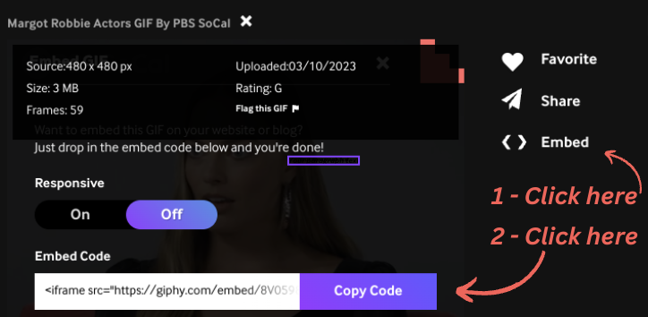

# GIF ASCII ART

> :warning: **This is not the original github project**: the original git history is not copied and is only available in [this private repository](https://github.com/me50/kevin-menon/tree/cs50/problems/2022/python/project) but I am only contributor. Harvard CS50's team is the owner, hence I cannot enable the fork setting. Except for this warning, all contents are the same as on the original repo.


#### Video Demo:  https://youtu.be/Ul4DNuI5Hpo

## Description
> **_NOTE:_**  This project is my final project submission for [CS50's Introduction to Programming with Python](https://cs50.harvard.edu/python/2022/project/)


The goal of this project is to convert a GIF image to an ASCII animation on the standard output file.

For this I use mainly two packages: [Pillow](https://github.com/python-pillow/Pillow) and [ascii_magic](https://github.com/LeandroBarone/python-ascii_magic).

The first allows to convert each frame of the GIF to an image object, manipulate it. Whereas the second package allows to easily convert an image to ASCII.

There are three options to create a GIF ASCII art:
- File: a file or files on the system
- Folder: will search .gif/.GIF files in the said folder (with recursive option)
- Web: either a random or specific GIF provided by the GIPHY REST API. A specific GIF can be provided via its ID

The GIF ASCII art is implemented in order to not "pile" the different ASCII frames of the GIF. Instead, it removes each ASCII frame after it is rendered to the terminal, before going on to the next.

The Animation will also display a classic ASCII art text after each GIF ASCII art.

## Requirements

### Create an API Key on Giphy

You can create an API key by following [Giphy's docs](https://developers.giphy.com/docs/api#quick-start-guide).

Once created, copy the API key in a `.env` file at the root of the project with the key `GIPHY_API_KEY`. This is necessary to connect to the Giphy REST API.

### Package dependencies

Ensure you have python and pip. Now install the package dependencies

```bash
pip install -r requirements.txt
 ```


## Usage

```bash
project/ $ python project.py --help
usage: project.py [-h] [--message MESSAGE] [--monochrome] [--debug] {FILE,WEB,FOLDER} ...

This program will display a GIF image to your tutorial and exit with a message.

positional arguments:
  {FILE,WEB,FOLDER}
    FILE             Provide GIF file(s) to render in ASCII
    WEB              Will fetch a meme from the GIPHY API
    FOLDER           Will animate GIF files in a folder

options:
  -h, --help         show this help message and exit
  --message MESSAGE  Message to print after each GIF
  --monochrome       Colorized or not
  --debug            Will set logging level to debug. Beware it may conflict with the ASCII animation
 ```

### From a file


### From the web



The ID parameter is the ID GIPHY assigns to the image. It can be found by looking at a GIF, clicking on `embed`, copying the link with `copy link` and extracting the ID from the URL.



For example, we can get an embed code of this format:
```html
<iframe src="https://giphy.com/embed/8V05982xOCp2mDRzwS" width="480" height="480" frameBorder="0" class="giphy-embed" allowFullScreen></iframe><p><a href="https://giphy.com/gifs/PBSSoCal-actors-variety-studio-on-8V05982xOCp2mDRzwS">via GIPHY</a></p>
```
The ID is what follows the `https://giphy.com/embed/` in the `src` attribute of the `iframe`. In this case: **8V05982xOCp2mDRzwS**.

## Quickstart

If you want to integrate these features in your code:
```python
from ascii import GifAsciiArt

gif_ascii_art = GifAsciiArt('nyan-cat.gif')

for ascii_frame in gif_ascii_art.ascii_frames:
    ascii_frame.to_terminal()
```

## Project structure

```bash
.env # environment file to store secrets
requirements.txt # package dependencies for pip
demo # files for README.md
      |get_giphy_id.png
      |file_gif_ascii.gif
      |web_gif_ascii.gif
__init__.py # make the folder a package
ascii.py # where the logic happens
gifs # gif samples
      |this-is-cs50.gif
      |this-is-fine.gif
      |nyan-cat.gif
README.md # documentation
project.py # entrypoint of the CLI
test_project.py # test the ascii.py module
veritas.png # sample image used for the tests
```

## License

Copyright (c) 2023 Kevin Menon.

Usage is provided under the MIT License. See LICENSE for the full details.